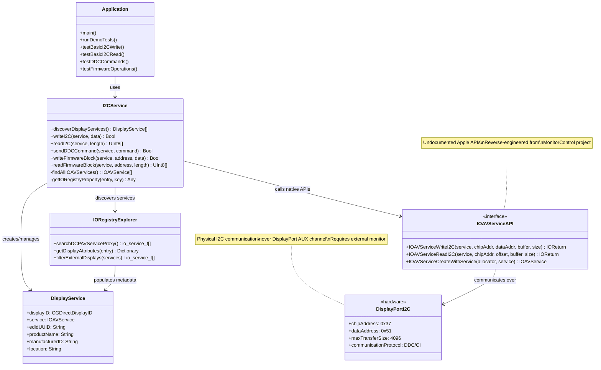

# I2C Communication on macOS via DisplayPort

A comprehensive demonstration of MCU firmware flashing capabilities using DisplayPort I2C communication on macOS through undocumented IOAVService APIs.

## Overview

This project implements I2C communication over DisplayPort channels on macOS computers, specifically targeting monitor scaler IC firmware updates. It leverages reverse-engineered Apple APIs (`IOAVServiceWriteI2C`/`IOAVServiceReadI2C`) that provide direct access to DisplayPort I2C channels.

## Features

- **IOAVService Discovery**: Automatic detection of external DisplayPort/USB-C displays
- **Raw I2C Operations**: Direct read/write operations with proper error handling
- **DDC/CI Support**: Monitor control commands (brightness, contrast, etc.)
- **Firmware Block Operations**: Large data transfers up to 4KB per operation
- **Comprehensive Testing**: 5 different test scenarios with verification
- **Apple Silicon Optimized**: Designed for M1/M2 Macs with proper API usage

## Technical Implementation

### Core APIs Used
```c
IOReturn IOAVServiceWriteI2C(IOAVService service, uint32_t chipAddress, uint32_t dataAddress, void* inputBuffer, uint32_t inputBufferSize);
IOReturn IOAVServiceReadI2C(IOAVService service, uint32_t chipAddress, uint32_t offset, void* outputBuffer, uint32_t outputBufferSize);
```

### Key Components
- **I2CService.swift**: Main implementation with service discovery and I2C operations
- **I2CService.h**: C header declarations for IOAVService APIs
- **main.swift**: Comprehensive demo application with test scenarios
- **Bridging Header**: Swift/Objective-C interoperability

### Service Discovery Process
1. Iterate through IORegistry for DCPAVServiceProxy entries
2. Filter for external displays (Location = "External")
3. Create IOAVService instances for I2C communication
4. Extract display metadata (EDID UUID, product info)

## Requirements

### System Requirements
- **macOS**: 12.0+ (Monterey or later)
- **Hardware**: Apple Silicon Mac (M1/M2) recommended
- **Display**: External monitor via DisplayPort/USB-C/Thunderbolt
- **Privileges**: Admin/root access for IOKit operations

### Build Requirements
- **Xcode**: 14.0+
- **Swift**: 5.0+
- **Frameworks**: IOKit, CoreGraphics, Foundation

## Building and Running

### Build with Xcode
1. Open `studyi2c.xcodeproj` in Xcode
2. Ensure the following frameworks are linked:
   - IOKit.framework
   - CoreGraphics.framework
3. Build the project (⌘+B)

### Build with Command Line
```bash
# Use the provided build script
./test_build.sh

# Or build directly with xcodebuild
xcodebuild -project studyi2c.xcodeproj -scheme studyi2c build
```

### Running the Demo
```bash
# Requires sudo for IOKit access
sudo ./path/to/studyi2c
```

## Demo Test Scenarios

The application demonstrates 5 key I2C communication scenarios:

1. **Basic I2C Write**: Simple data transmission test
2. **Basic I2C Read**: Data reception and parsing
3. **DDC/CI Commands**: Monitor brightness query example
4. **Firmware Block Operations**: 256-byte firmware simulation
5. **Large Data Transfer**: 4KB maximum transfer test

## Use Cases

### Primary Applications
- **Monitor Scaler IC Firmware Updates**: Update firmware on display controllers
- **Display Calibration**: Advanced monitor configuration beyond standard DDC
- **Custom Display Protocols**: Implement proprietary display communication
- **Hardware Diagnostics**: Low-level display hardware testing

### Research Applications
- **DisplayPort Protocol Analysis**: Study I2C over AUX channel behavior
- **Reverse Engineering**: Analyze display controller implementations
- **Performance Testing**: Measure I2C transfer rates and reliability

## Important Considerations

### API Limitations
- **Undocumented APIs**: May break in future macOS updates
- **Apple Silicon Focus**: Best compatibility on M1/M2 Macs
- **Transfer Limits**: 4KB maximum per operation
- **Admin Required**: IOKit access needs elevated privileges

### Development Guidelines
- Always verify data integrity with checksums
- Implement proper retry logic for reliability
- Test extensively with target hardware
- Plan fallback strategies for API changes

## Architecture



## Disclaimer

This project uses undocumented Apple APIs for research and development purposes. The APIs may change or be removed in future macOS versions. Use at your own risk in production environments.

## References

- [MonitorControl Project](https://github.com/MonitorControl/MonitorControl): Inspiration and API patterns
- [DDC/CI Specification](https://milek7.pl/ddcbacklight/ddcci.pdf): Display Data Channel standard
- [DisplayPort Standard](https://www.displayport.org/): Official DisplayPort specification
